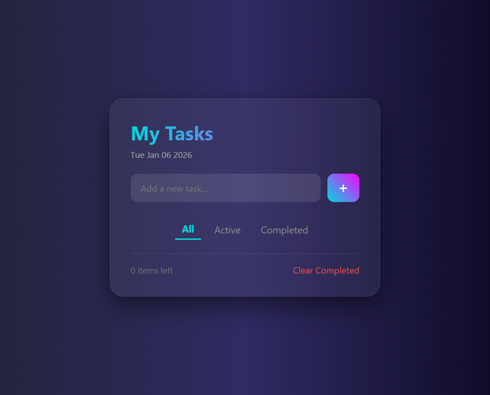
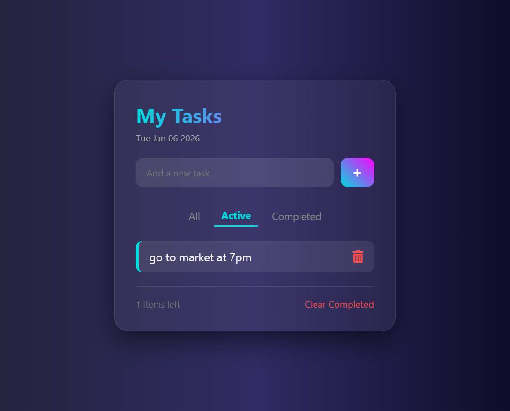
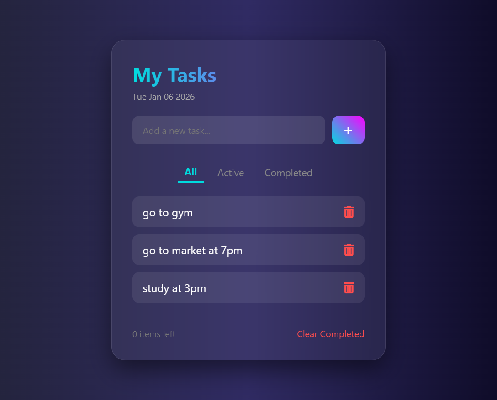
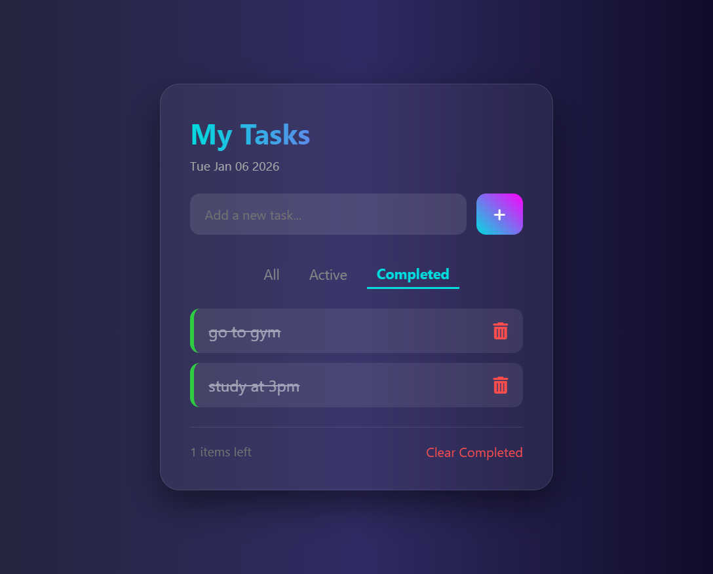
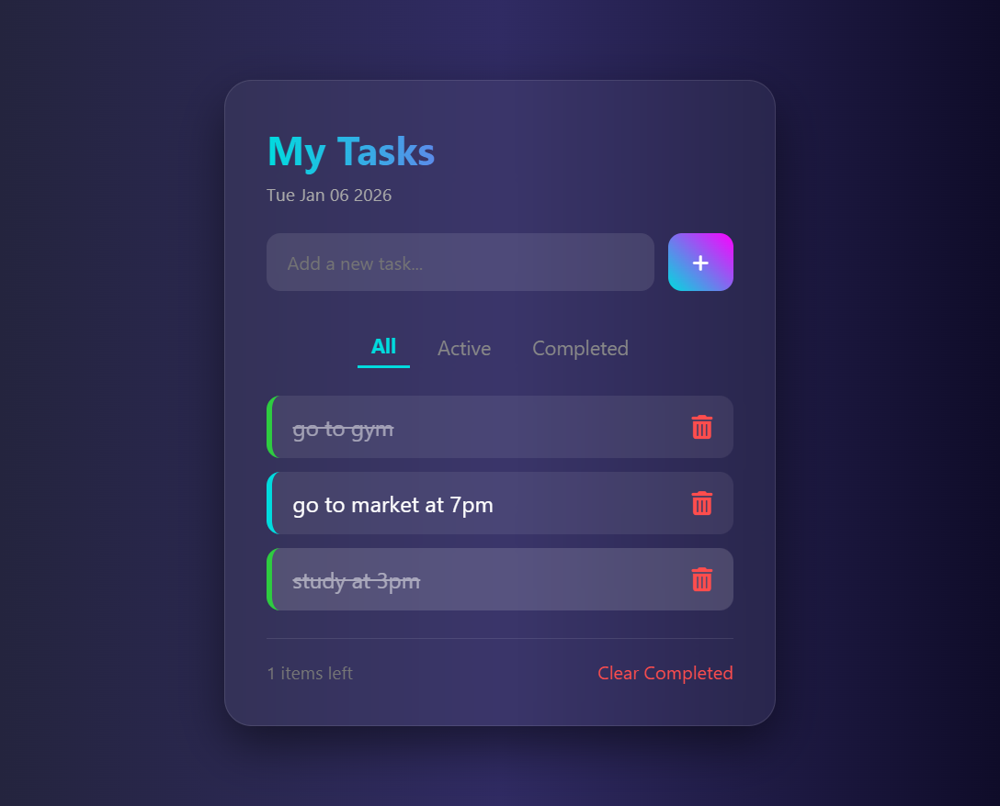

# ✅ Pro Task Manager (To-Do List)

A high-end, feature-rich To-Do List application designed for productivity. This app doesn't just list tasks; it manages them using **State Management** logic and persistent storage.


## 🚀 Advanced Features

- **Persistent Storage:** Uses `localStorage` to save your tasks. Even if you refresh the page or close the browser, your data stays safe.
- **Smart Filtering:** - **All:** View every task.
  - **Active:** Focus only on pending work.
  - **Completed:** Review your finished goals.
- **Dynamic UI:** Built with a **Glassmorphism** theme and smooth CSS transitions.
- **Task Counter:** Real-time "Items Left" counter to keep track of your progress.
- **Bulk Actions:** "Clear Completed" feature to remove all finished tasks with one click.
- **Responsive & Interactive:** Fully mobile-responsive with hover effects and entrance animations.

## 🛠️ Tech Stack

- **HTML5:** Semantic structure for better accessibility.
- **CSS3:** Advanced gradients, Backdrop filters (Glassmorphism), and Flexbox.
- **JavaScript (ES6+):** - Array Methods (`.filter()`, `.map()`, `.splice()`).
  - JSON handling (`JSON.stringify`, `JSON.parse`).
  - Event Listeners for seamless interaction.

## Screenshots














## 📦 Installation & Usage

1. **Clone the repo:**
   ```bash
   git clone (https://github.com/ZainAhmad393/To-Do-List-app.git)
